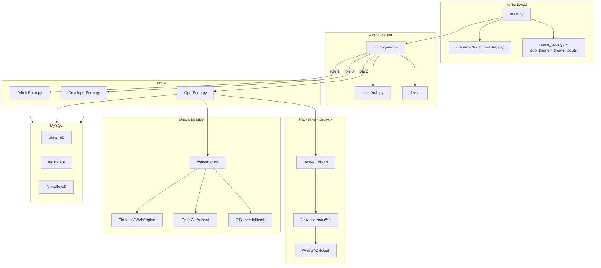

# Steelmaking Converter — Архитектура

Десктопное PyQt5-приложение для обучения операторов управлению сталеплавильным конвертером.
Роль-ориентированная навигация, пошаговый расчётный движок плавки, 3D-визуализация процесса, единая система тем, MySQL-backend.

**3 роли · 3 БД MySQL · ~15 модулей Python · 8 Qt .ui-форм · 8 этапов расчёта**

---

## Общая схема



---

## Поток запуска и авторизации

| Шаг | Компонент | Описание |
|-----|-----------|----------|
| 1 | `converter3d/qt_bootstrap.py` | Подготовка путей к Qt/PyQt (vendor, DLL на Windows) до импорта виджетов |
| 2 | `main.py` | `QApplication`, `AA_ShareOpenGLContexts` для WebEngine, загрузка темы из `dev.ini` |
| 3 | `Ui_LoginForm.setupUi()` | Экран входа, переключатель темы `ThemeToggle` |
| 4 | `hashAuth.Hash.getHash()` | MD5-хэш пароля |
| 5 | `users_db.users` | `SELECT Roles_idRoles WHERE Login=… AND Password=…` |
| 6 | Роль 1 | `AdminForm.Ui_AdminFom` — администрирование |
| 7 | Роль 2 | `OperForm.Ui_OperatorForm` — симулятор плавки |
| 8 | Роль 3 | `DeveloperForm.Ui_Form` — справочники модели |
| 9 | Настройки | `connSettings.Ui_ConnectionSettings` → редактирование `dev.ini` |

---

## Модули программы

### Ядро приложения

| Файл | Класс / объект | Назначение |
|------|----------------|------------|
| `main.py` | `Ui_LoginForm` | Точка входа, авторизация, маршрутизация по ролям |
| `config.py` | `UserLogin` | Глобальная переменная — логин текущей сессии |
| `hashAuth.py` | `Hash.getHash()` | MD5-хэширование пароля |
| `connSettings.py` | `Ui_ConnectionSettings` | Диалог настроек MySQL, тест соединения |
| `AboutForm.py` | `Ui_Dialog` | Диалог «О программе» |
| `createini.py` | — | Служебный скрипт создания/теста `dev.ini` |
| `build_code.py` | — | Вспомогательный скрипт сборки |
| `neuro.py` | *(закомментировано)* | Заготовка Keras Sequential (20→17 параметров), отключена |

### Формы по ролям

| Файл | Класс | Роль | Описание |
|------|-------|------|----------|
| `AdminForm.py` | `Ui_AdminFom` | Администратор | Пользователи, справочники `regimdata`, сценарии, экспорт в Excel |
| `OperForm.py` | `Ui_OperatorForm` | Оператор | Симулятор плавки: сценарии, 8 этапов расчёта, 3D-панель, протокол обучения |
| `DeveloperForm.py` | `Ui_Form` | Разработчик | Просмотр и редактирование таблиц `regimdata` |

### Система тем

| Файл | Назначение |
|------|------------|
| `theme_settings.py` | `ThemeManager` — чтение/запись темы (`dark`/`light`) в `[AppSettings]` секции `dev.ini`, сигнал `theme_changed` |
| `theme_toggle.py` | Виджет-переключатель светлой/тёмной темы |
| `app_theme.py` | Централизованные QSS-стили, палитры, токены для всех форм (login, operator, admin, developer, tables, message boxes) |
| `control_inputs.py` | `ControlInputsPanel` — ручные крутилки дутья/фурмы, пресеты JSON, сигнал `controls_changed` |

### 3D-визуализация (`converter3d/`)

| Файл | Назначение |
|------|------------|
| `widget.py` | Фабрика `create_converter_widget()` — выбор бэкенда, единый API `update_state(dict)` |
| `converter.html` + `three.min.js` | Three.js-сцена (основной рендер через Qt WebEngine) |
| `opengl_widget.py` | OpenGL-рендер (fallback) |
| `visual_style.py` | Цветовые пресеты 3D-сцены под UI-тему |
| `qt_bootstrap.py` | Bootstrap PyQt/WebEngine на Windows |

**Приоритет бэкендов:** WebEngine (Three.js) → OpenGL → QPainter (чистый PyQt5).

---

## Интерфейс формы оператора (OperForm)

Трёхколоночный layout (`QSplitter`):

| Панель | Содержимое |
|--------|------------|
| Левая | Ввод данных: чугун, лом, целевая сталь, флюсы, ферросплав, сценарий |
| Центр | Панель «Управляющие воздействия» + последовательность расчётов (8 этапов с LED-индикаторами) + 3D-конвертер (в сплиттере) |
| Правая | Мониторинг: температура, перегрев, KPI, рекомендации, протокол |

**Особенности UI:**
- Кнопки этапов защищены guard-логикой — нельзя перейти к следующему этапу без завершения предыдущего
- LED-индикаторы обновляются таймером `_refresh_stage_leds()` каждые 300 мс
- Кнопка «ЗАПУСТИТЬ ВСЕ ЭТАПЫ» → `GetScenarioExample()` → `WorkerThread` → `run_calculations()`
- Стили через `app_theme.py`, переключение темы без перезапуска

---

## Базы данных MySQL

### users_db
- `users` — Login, Password, Roles_idRoles
- `userroles` — idRoles, RoleName

### regimdata
- `mode` — режимы плавки (ссылки на сталь, лом, чугун)
- `steeldata` + `steelcomposition` — марки стали (C, S, P, Si, Mn)
- `caststeeldata` + `caststeelcomposition` — чугун (масса, T, состав)
- `scrapdata` + `scrapcomposition` — лом (масса, состав)
- `fluxedata` + `fluxecomposition` — флюсы (CaO, SiO2, MgO, Fe2O3, FeO, MnO, Al2O3, CaCO3, MgCO3)
- `fluxedata_has_mode` — связь флюсов с режимами и их массы
- `scenario` — ScanrioName, ScenarioTask, лимиты C/P/T, mode_idMode
- `v_combined_data` — представление со сводными данными режима

### ferroalloydb
- `ferroalloy` — Name, химический состав ферросплавов

---

## Конфигурация

Файл `dev.ini`:

```ini
[DBsettings]
dbhost = localhost
login = root
password = root

[AppSettings]
theme = dark
```

| Объект | Назначение |
|--------|------------|
| `dev.ini` → `[DBsettings]` | Параметры подключения к MySQL |
| `dev.ini` → `[AppSettings]` | Тема интерфейса (`dark` / `light`) |
| `config.UserLogin` | Логин текущего пользователя в runtime |
| Глобальные флаги в `OperForm.py` | `metalChargeCalcked`, `tableCalcked`, `slagCalcked`, `blastCalcked`, `materialBalanceCalcked`, `heatBalanceCalcked` |
| `Protokol`, `step` | Накопленный текст протокола обучения и номер шага |
| `listOfNamesForClass[16]` | Массив объектов `FluxeComposition` для расчёта флюсов |

---

## Связь расчётов с 3D-визуализацией

| Этап расчёта | `update_state()` ключи |
|--------------|------------------------|
| `calcMetalChargeClicked` | `state='charged'`, `metalMass`, `metalLevel`, `slagMass=0` |
| `slagCalcClicked` | `state='blowing'`, `slagMass`, `slagLevel`, `temperature=1500` |
| `blastCalcClicked` / панель управления | `blastFlow` (м³/мин), `lanceHeight`, `penetrationDepth`, `reactionZoneActive` |
| `HeatBalanceCalcClicked` | `temperature` (расчётная T стали) |
| `getRecomendation` | `state='complete'`, `temperature` |

---

## Слой GUI (Qt Designer)

Файлы `GUI/*.ui` — макеты Qt Designer. Генерируются через `pyuic5` в `file*.py`.
Основная бизнес-логика и UI формы оператора реализованы **программно** в `OperForm.py` (без `.ui`).

| Сгенерированный файл | Источник |
|----------------------|----------|
| `fileAdmin.py` | `GUI/AdminForm.ui` |
| `fileConn.py` | `GUI/ConnectionSettings.ui` |
| `filenameconverted.py` | `GUI/OperForm.ui` (устаревший макет) |

---

## Ключевые зависимости

| Пакет | Назначение |
|-------|------------|
| `PyQt5` | GUI, виджеты, потоки (`QThread`), `QPainter` |
| `PyQtWebEngine` | 3D через Three.js (опционально, `requirements-3d.txt`) |
| `PyOpenGL` | OpenGL fallback для 3D |
| `mysql-connector-python` | Подключение к MySQL |
| `pandas` + `openpyxl` | Экспорт таблиц в `.xlsx` (AdminForm) |
| `configparser` | Чтение/запись `dev.ini` |
| `hashlib` (MD5) | Хэширование паролей |
| `TensorFlow / Keras` *(откл.)* | Заготовка в `neuro.py` |

---

# Функции, используемые в расчётах

Все расчётные функции сосредоточены в `OperForm.py` (класс `Ui_OperatorForm`).
Каждый этап проверяет флаг предыдущего и при необходимости вызывает его автоматически.
Оркестратор полного цикла — `run_calculations()`.

## Цепочка вызовов

```
GetScenarioExample()
  └─ WorkerThread.run()          ← загрузка сценария из БД (async)
       └─ run_calculations()
            ├─ chooseMods()
            ├─ calcMetalChargeClicked()      [1]
            ├─ calcTableClick()              [2]
            ├─ slagCalcClicked()             [3]
            ├─ blastCalcClicked()            [4]
            ├─ MaterialBalanceCalcClicked()  [5]
            ├─ HeatBalanceCalcClicked()        [6]
            ├─ AddFeroBtnClicked()           ← загрузка ферросплава (не расчёт)
            ├─ deoxCalc()                    [7]
            └─ getRecomendation()            [8]
                 └─ calcPhosphor()
                 └─ checkLimits()
```

---

## 1. `calcMetalChargeClicked()` — металлошихта

**Флаг:** `metalChargeCalcked`

**Вход:** массы и составы чугуна и лома из полей формы.

**Формулы:**
- `G_шихты = m_чугун + m_лом`
- Средневзвешенный состав каждого элемента:
  `X_шихты = (X_чугун × m_чугун + X_лом × m_лом) / G_шихты`
  для X ∈ {C, S, Si, P, Mn}

**Выход:** поля `MetalCharge`, `ChemCarbon`, `ChemSerum`, `ChemPhosphor`, `ChemSilicon`, `ChemManganese`.

**3D:** `state='charged'`, уровень металла пропорционален массе.

---

## 2. `calcTableClick()` — таблица окисления

**Флаг:** `tableCalcked` · **Зависимость:** `metalChargeCalcked`

**Вход:** химический состав шихты, целевой состав стали (`steelCarbon` и др.).

**Логика (таблица `OxidationTable`, 6 строк × 8 столбцов):**

| Строка | Содержание |
|--------|------------|
| 0 | Состав шихты до продувки (C, Si, Mn, P, S) |
| 1 | Целевой состав стали после продувки |
| 2 | Убыль элементов (C→90% CO + 10% CO₂; Si→0; Mn/P/S — частичное удаление) |
| 3 | Расход O₂ на окисление (кг) |
| 4 | Расход O₂ (м³, через 22.4/32) |
| 5 | Суммарные оксиды, уходящие в шлак |

**Степени удаления Mn/P/S** зависят от `%C` в целевой стали:

| %C в стали | Mn удал. | P удал. | S удал. |
|------------|----------|---------|---------|
| ≤ 0.10 | 85% | 93% | 37% |
| 0.10–0.25 | 77% | 87% | 43% |
| > 0.25 | 73% | 83% | 47% |

Кремний после продувки принимается равным 0.

---

## 3. `slagCalcClicked()` — расчёт шлака

**Флаг:** `slagCalcked` · **Зависимость:** `tableCalcked`

**Вход:** оксиды из строки 5 `OxidationTable`, состав и массы флюсов из `FluxeTable` (до 16 шт., класс `FluxeComposition`).

**Формулы:**
- CaO из флюсов: `CaO + CaCO₃ × 52/96`
- MgO из флюсов: `MgO + MgCO₃ × 40/84`
- SiO₂, Al₂O₃ — прямой вклад из флюсов
- `%FeO = 20 + 0.218/C_стали + 0.031/P_стали`
- `%Fe₂O₃`: 9 (< 0.1% C), 5 (0.1–0.25% C), 4 (> 0.25% C)
- `G_шлака = (SiO₂ + CaO + MgO + Al₂O₃ + прочие) / (100 − FeO − Fe₂O₃) × 100`

**Выход:** `SlagWeight`, массы и проценты компонентов шлака.

**3D:** `state='blowing'`, уровни металла и шлака, T=1500°C.

---

## 4. `blastCalcClicked()` — расчёт дутья

**Флаг:** `blastCalcked` · **Зависимость:** `slagCalcked`

**Формулы:**
- `O₂_общ = O₂_окисление (стр.3, col.7) × G_шихты / 100`
- `O₂_железо = FeO_шлака × 16/72 + Fe₂O₃_шлака × 48/160`
- `O₂_дожигание CO = CO_оксиды × G_шихты / 100 × 0.1 × 16/28`
- `O₂_флюсы` — вычитается O₂ из FeO/Fe₂O₃ флюсов
- `O₂_итого = O₂_общ + O₂_железо + O₂_дожигание − O₂_флюсы`
- `G_дутья (кг) = O₂_итого × 1.01 × 100 / 99.5`
- `V_дутья (м³) = G_дутья × 22.4/32`
- Избыток дутья: 8%

**Выход:** `TotalOxygenDemandBlast`, `TotalConsumptionOfBlastKg`, `TotalConsumptionOfBlastM3`, `ExcessBlast`.

**3D:** `blastFlow`.

---

## 5. `MaterialBalanceCalcClicked()` — материальный баланс

**Флаг:** `materialBalanceCalcked` · **Зависимость:** `blastCalcked`

**Приход:**
- Чугун, лом, флюсы, кислородное дутьё → таблица `IncomingData`

**Расход:**
- Масса окисленных примесей
- Оксиды железа, уходящие в шлак
- Потери с уносом: `0.02 × G_шихты`
- Пыль: `0.00001 × 200 × 70 × V_газов (м³)`
- Возврат металла из флюсов (`ReclaimedIronWeight`)

**Газовый баланс** (`OutputDataTable`):
- CO, CO₂ из реакций углерода
- CO₂ из разложения CaCO₃ (× 44/96) и MgCO₃ (× 44/84)
- Дожигание 10% CO → CO₂
- Пересчёт в м³ (22.4/28 для CO, 22.4/44 для CO₂)

**Выход жидкого металла:**
```
G_металл = G_шихты + G_возврат − (примеси + оксиды + унос + пыль)
```
→ поле `LiquidIronYield`.

---

## 6. `HeatBalanceCalcClicked()` — тепловой баланс

**Флаг:** `heatBalanceCalcked` · **Зависимость:** `materialBalanceCalcked`

### Приход тепла (`IncomingHeatTable`)

| Статья | Формула |
|--------|---------|
| Физ. тепло чугуна | `(61.9 + 0.88 × T_чугун) × G_чугун × 1000` |
| Тепло реакций окисления | `(14770×ΔC + 26970×ΔSi + 7000×ΔMn + 21730×ΔP) × G_шихты × 10` |
| Тепло образования FeO/Fe₂O₃ | `3707 × FeO_шлака × 1000 + 5278 × Fe₂O₃_шлака × 1000` |
| Тепло шлакообразования | `628 × CaO × 1000 + 1464 × SiO₂ × 1000` |
| Дожигание CO | `101 × 100 × |CO_дожиг| × 1000 × 0.2` |

### Расход тепла (`OutputHeatTable`)

| Статья | Формула |
|--------|---------|
| Физ. тепло металла | `(54.8 + 0.84 × T_стали) × G_металл × 1000` |
| Физ. тепло шлака | `(2.09 × T_стали − 1379) × G_шлака × 1000` |
| Физ. тепло газов | `(1.32 × 2000 − 220) × (CO + CO₂)` |
| Разложение FeO/Fe₂O₃ флюсов | `3707 × FeO_флюсов + 5278 × Fe₂O₃_флюсов` |
| Потери с выноса | `(54.8 + 0.84 × 1550) × G_выноса` |
| Пылеобразование | `(54.8 + 0.84 × 2000) × G_пыли` |
| Разложение карбонатов | `4038 × (CaCO₃ + MgCO₃) × 1000` |
| Тепловые потери | 3% от общего прихода |

**Температура стали:**
```
T = (Q_приход − Q_расход_без_металла + 1379×G_шлака×1000 − 54.8×G_металл×1000)
    / (0.84×G_металл×1000 + 2.09×G_шлака×1000)
```

**Перегрев:** `T_стали − (1539 − 80 × %C_целевой)`

**Выход:** `LiquidSteelTemp`, `OverheatTemp`.

**3D:** обновление `temperature`.

---

## 7. `deoxCalc()` — раскисление

**Зависимость:** `heatBalanceCalcked`, выбранный ферросплав в `ChemEmission`.

**Подрасчёты:**

### Растворимость MgO и износ футеровки
```
A = 0.256 × T − 335
B = 0.066 × T − 85
lim_MgO = |(A − B × CaO/SiO₂) × 0.075 × FeO − 0.875|
Износ = 4.112×10⁻⁶ × T × (lim_MgO × MgO_шлака)
```

### Расход ферросплава (Mn)
Угар Mn (`umn`) зависит от остаточного %C:

| %C | umn |
|----|-----|
| < 0.10 | 27.5% |
| 0.10–0.25 | 25.0% |
| > 0.25 | 17.5% |

```
G_феросплав = 100 × G_металл × 1000 × (Mn_цел − Mn_факт)
              / (Mn_в_сплаве × (100 − umn))
```

### Баланс раскисления (`DeoxidationBalance`, 6 строк)
1. Состав металла до раскисления (%)
2. Массы элементов до раскисления (кг)
3. Внесение из ферросплава (кг)
4. Суммарные массы (кг)
5. Оксиды от раскисления (кг)
6. Итоговый химический состав стали (%)

**Выход:** `SteelChemResult`, `SlagChemResult`, `SteelWeightRes`, `CO2ThrowRes`, вызов `stepResult()`.

---

## 8. `getRecomendation()` — рекомендации и контроль

**Зависимость:** завершённый тепловой баланс.

**Вызывает:** `calcPhosphor()`, `checkLimits()`.

### `calcPhosphor()` — распределение фосфора
```
log Lp = 22350/T + 2.5×ln(FeO) + 0.08×CaO − 16
Lp = 0.099 × exp(log Lp) + 30
%P_стали = %P_шихты / Lp × 100
```

### Анализ шлака
- Основность: `CaO / SiO₂`
- Недосыщение MgO: `lim_MgO − MgO_факт`
- Если недосыщение > 3 → рекомендация увеличить магнезиальный флюс на 50 кг

### `checkLimits()` — проверка ограничений сценария
Сравнивает фактические C, T, P стали с лимитами (`SteelCarbonLimit`, `MinSteelTempLimit`, `SteelPhosphorLimit`).
При нарушении — подсветка полей красным и текст предупреждения в `recomendation`.

**3D:** `state='complete'`.

---

## Вспомогательные функции (не расчётные, но участвуют в цикле)

| Функция | Роль в расчётном цикле |
|---------|------------------------|
| `chooseMods()` | Загрузка из БД составов чугуна, лома, стали-цели и флюсов режима — подготовка входных данных |
| `getFluxeInMode(modeId)` | Заполнение `FluxeTable` флюсами текущего режима |
| `AddFeroBtnClicked()` | Загрузка состава ферросплава — обязательный вход для `deoxCalc()` |
| `GetScenario()` / `GetScenarioExample()` | Загрузка задания и лимитов сценария; Example запускает полный автоматический расчёт |
| `WorkerThread.run()` | Асинхронная загрузка сценария из БД перед `run_calculations()` |
| `run_calculations()` | Оркестратор — последовательный вызов всех 8 этапов |
| `CheckConverterFunc()` | Проверка геометрии конвертера: H/D ∈ [1.17 … 2.1] |
| `stepResult()` | Фиксация результатов шага в протокол обучения |
| `saveResult()` | Сохранение протокола в файл (.txt / .html) |

---

## Классы данных расчёта

### `FluxeComposition`
Хранит состав одного флюса для расчётов шлака и балансов:

```
name, fluxeCaO, fluxeSiO2, fluxeMgO, fluxeFe2O3, fluxeFeO,
fluxeAl2O3, fluxeCaCO3, fluxeMgCO3, fluxeWeight
```

Массив `listOfNamesForClass` — до 16 экземпляров, заполняется в `slagCalcClicked()`.

### Глобальные флаги этапов
```python
metalChargeCalcked = False
tableCalcked = False
slagCalcked = False
blastCalcked = False
materialBalanceCalcked = False
heatBalanceCalcked = False
```

Сбрасываются при каждом новом `setupUi()`.
